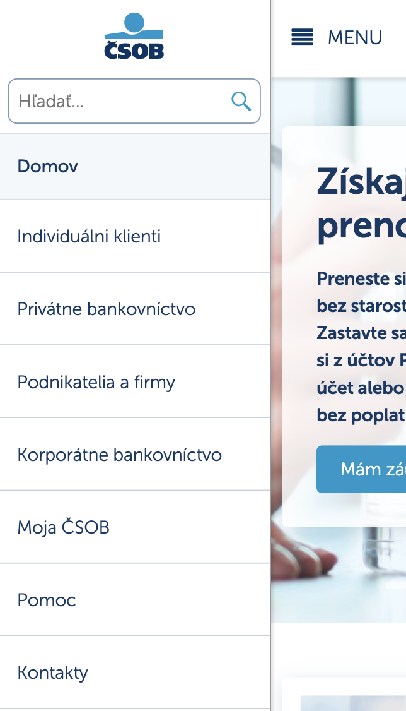

# Validation of Information Architecture: Cross-methodological Comparison of Tree Testing Variants and Prototype User Testing

## About

This is the official repository for the research paper *"Validation of Information Architecture: Cross-methodological Comparison of Tree Testing Variants and Prototype User Testing"*. The work addresses differences in implementation of the Tree Testing method and assesses the capability of these variants to to reliably simulate interactions in information architecture by comparison with menu navigation in high-fidelity website prototypes.

### Paper citation

Not published yet.

### Contents

* [Dataset](#dataset)
* [Scripts](#scripts)
* [Experiment](#experiment)
* [Authors](#authors)
* [License](#license)

## Dataset

A novel dataset was required for the purposes of the research, which was obtained via two studies. The dataset contains observations of information architecture interactions from 180 participants providing 1800 task completions in total. The resulting final dataset located in the analysis folder contains following files:
- [Participant data](./analysis/data/respondents.csv): Demographics and other metadata characteristics.
- [Results data](./analysis/data/results.csv): Task interactions, paths and calculated metrics.
- [Tree data](./analysis/data/tree.csv): Information architecture (IA), the hierarchical tree structure used consistently across study conditions.

During data processing, [raw data files](./analysis/data/raw/) - raw exports from [UXtweak tool](https://www.uxtweak.com/) were used to create the final dataset.

## Scripts

See below for guidelines on configuring the virtual environment used for data analysis, and an explanation of key scripts found in the file structure.

### Environment

All of the scripts located in the analysis folder are written using Python (version 3.12.1) and other external libraries installed using pip (version 23.2.1). Scripts were executed using jupyter notebooks. A [requirements file](./analysis/requirements.txt) is provided for installing dependencies. After installing Python, the below commands can be used in the [analysis](./analysis/) directory to install the environment and launch the notebooks:
```
python -m venv .venv
.venv\Scripts\activate
pip install -r requirements.txt
jupyter notebook
```

On Mac devices, this process could be slightly different:
```
python3 -m venv .venv
source .venv/bin/activate
pip install -r requirements.txt
jupyter notebook
```

This will create your virtual environment, install the dependencies and launch the python notebooks with the analysis files. After the installation, to launch the notebooks again, use just these commands:
```
.venv\Scripts\activate
jupyter notebook
```

Or on Mac:
```
source .venv/bin/activate
jupyter notebook
```

Alternatively, you can use any available IDE and create the environment using the requirements file from the editor itself (IDEs such as VS Code).

Additionally, R laguage was also used. For executing the script, one has to have R installed, preferably with an IDE such as R studio in which the script can be launched.

### Files

Following files are present in the [scripts directory](/analysis/scripts/):

- [Data preparation](/analysis/scripts/1-1_data-preparation.ipynb) of raw export files - data cleaning, column renaming and merging into resulting files, outlier removal.
- [Data calculation](/analysis/scripts/1-2_data-calculation.ipynb) - calculating metrics from interaction data.
- Exploratory data analysis of the dataset:
  - [Respondents data](/analysis/scripts/2-1_respondents-eda.ipynb).
  - [Results data](/analysis/scripts/2-2_results-eda-variants.ipynb) - comparison of variants.
  - [Results data](/analysis/scripts/2-3_results-eda-tasks.ipynb) - comparison and analysis of tasks.
- [Hypothesis testing](/analysis/scripts/3-1_stats-tests.ipynb) - using statistical tests
- [Hypothesis testing in R](/analysis/scripts/3-2_stats-tests.r) - r language file, using statistical tests
- Other files:
  - [Constants](/analysis/scripts/constants.py) with tree structure and other useful constants and methods used.
  - [Charts](/analysis/scripts/charts.py) with useful plotting methods.
  - [Tests](/analysis/scripts/stat_tests.py) with methods for statistical tests.
  - [Tree parser](/analysis/scripts/tree_to_data.py) for parsing the CSV tree into JSON.


## Experiment

### Studies

For all between-subject experiment conditions, fully experienceable experimental procedures are available as previews (i.e., identical to the participant's experience, but not collecting data) in the links below:

**Study 1: Tree testing variants:**
- [Tree test - Tree-visible variant](https://study.uxtweak.com/treetest/preview/RxczMieIHIzDVLUBTFrLX/cSOmahHWZ3lnmxFXGMsp8)
- [Tree test - Path-visible variant](https://study.uxtweak.com/treetest/preview/aDEPZGXRzIJ72RctowoLP/S3fszffwPdMVQeSIoV8Yv)
- [Tree test - Compact variant](https://study.uxtweak.com/treetest/preview/Q178hU2woCga063V4Xx62/9I5vwcRTkowlqMuQMaRAO)

**Study 2: High-fidelity prototype user testing of menu navigation:**
- [Web test - Desktop variant](https://study.uxtweak.com/webusability/gdpr/preview/QqR2LcpXSrs72SGkv3p60/eBW072UVdlF9btxnxvhSi/)
- [Web test - Desktop-intrusive variant](https://study.uxtweak.com/webusability/gdpr/preview/wRsx291czFETCREVKDJux/AIld7WgFRFcURXJ7UoOYR/)
- [Web test - Mobile variant](https://study.uxtweak.com/webusability/preview/mTSTNALFJkpPGgyq6VQOj/NZwXsl5RgNfLP54Dcg0AO)

### Webpage prototype

Web page prototypes used in Study 2 are hosted on github's public URLs:
- [Desktop variant](https://treetest-research.github.io/v4)
- [Desktop-intrusive variant](https://treetest-research.github.io/v5)
- [Mobile variant](https://treetest-research.github.io/v6) (only works properly on mobile devices)

The web page prototypes are available in the [webpage directory](./webpage/). The directory contains all files necessary to serve the webpage. 

Some factors in the Desktop-intrusive (use of colors in the navigation) and Mobile variants (overlaying menu) were inspired by real websites  to visually and interactively mimic actual variability of website navigations:

<table>
<tr>
<td><a href="https://www.bioderma.co.uk/">LINK</a></td>
</tr>
</table>
<table>
<tr>
<td height="600px"><br><a href="https://www.csob.sk">LINK</a></td>
<td height="600px"><br><a href="https://www.csob.sk">LINK</a></td>
</tr>
</table>

### Information architecture

Same [information architecture](./analysis/data/tree.csv) is used in both studies - rows are individual items, columns represent depth levels in the information hierarchy.

### Experiment messages

#### Welcome message
Welcome to this research study. Your response will **help us to better understand how people navigate through website content**. 
The whole **study shouldn't take longer than 15 minutes** to complete. Please **pay close attention** to the instructions to ensure that your participation is valid. If asked to, please answer the questions in as much detail as you can. The more effort you make, the more useful your answers will be to us. Thanks for participating.

#### Instructions
Here's how it works:

1. There are eleven simple tasks in total. All the tasks work as explained below.
2. During each task, you will be presented with **a menu** ***\[\*website\]***. The **task that you are going to receive will be to find something in the menu** (like an article or a piece of information).
3. Click through the menu until you **arrive at an item that you think is the solution**.
4. You **can always go back** if at any point during the task you feel like you have taken a wrong turn. You can think of it the same as when you are using a normal website menu. *\[\*You can always scroll down the page in case you think you are not seeing a part of the open menu.\]*
5. After each task, you will be **asked a couple of questions**.

***This is not a test of your ability, there are no right or wrong answers.*** *Don't worry if you can't find the right item, just try to answer the best you can.* 

**That's it, let's get started!**

#### Thank you message
All done, awesome! Thanks again for your participation. Your feedback is incredibly useful for us.
You may now leave this web page or close this window.

\*applies for web variants


### Experiment questionnaires
|Question|Question type|Options (if applicable)|
|---|---|---|
| **Initial questionnaire** |  |  |
| How old are you? | Single choice | 18-27, 28-37, 38-47, 48-57, 58+ |
| Which gender do you identify as? | Single choice | Man, Woman, Nonbinary |
| What is the highest education level you have completed? | Single choice | None completed, Secondary education, High school diploma, Technical/community college, Undergraduate degree, Graduate degree, Doctorate degree |
| What is your personal income per year, after tax? | Single choice | No income, £0 - £9,999, £10,000 - £19,999, £20,000 - £29,999, £30,000 - £39,999, £40,000 - £49,999, £50,000 - £74,999, £75,000 - £100,000, More than £100,000 |
| How often do you browse the web? | Single choice | For the major part of the day, Few times a day, From time to time (few times a week), Very sporadically (few times a month), Never |
| How often do you visit online magazines or news websites? | Single choice | Daily, From time to time (weekly), Very sporadically (monthly), Never |
| If you visit online magazines or news websites, provide some examples: | Open text |  |
| You may love pizza or ice cream. But when we ask you what you would order in the restaurant, you need to choose a salad. Based on the text above, what is a meal you would order in a restaurant? | Single choice | Salad, Pizza, Ice cream, Spaghetti, Fish and chips, Hamburger, Lasagna, Other |
| **Final questionnaire** |  |  |
| How many months are there in a year? Even though the correct answer is twelve, make sure to choose the option thirty. | Single choice | 1, 7, 12, 30, 365, Other |
| How simple or difficult do you find it to use the menu, if we focus just on how it feels to click through it? (Disregarding how it is organized.) | 7-point Likert scale, from Very difficult to Very easy |  |
| Is there anything else you’d like to tell us? | Open text |  |
| **After-task debriefing questionnaire** |  |  |
| I felt sure about my answer. | 7-point Likert scale, from Strongly disagree to Strongly agree |  |
| It was easy to complete this task | 7-point Likert scale, from Strongly disagree to Strongly agree |  |
| Is there any further information you would like to add about this task? Have you had any problems? Do you have any comments? | Open text |  |


## Authors

### General contact 

Email: 
**treetest.research@gmail.com**


**Eduard Kuric**\
He is a researcher and lecturer at [Faculty of Informatics and Information Technologies](https://www.fiit.stuba.sk/), [Slovak University of Technology in Bratislava](https://www.stuba.sk/). His research interests include human-computer interaction analysis, user modeling, personalized web-based systems, and machine learning. Eduard is also the head of the UX Research Department and the founder of [UXtweak](https://www.uxtweak.com/).
- [LinkedIn](https://www.linkedin.com/in/eduard-kuric-b7141280/)
- [Google Scholar](https://scholar.google.com/citations?user=MwjpNoAAAAAJ&hl=en&oi=ao)
- Email: eduard.kuric([AT])stuba.sk

**Peter Demcak**\
Researcher with background in software engineering, whose current topics of interest involve user behavior, human-computer interaction, UX research methods and design practices, and machine learning. Currently occupies the position of a scientific and user experience researcher at [UXtweak](https://www.uxtweak.com/), with focus on research that supports work of UX professionals.

- Email: peter.demcak([AT])uxtweak.com

**Matus Krajcovic**\
User experience researcher at [UXtweak](https://www.uxtweak.com/) and computer science student at [Faculty of Informatics and Information Technologies](https://www.fiit.stuba.sk/), [Slovak University of Technology in Bratislava](https://www.stuba.sk/). Currently focuses on data analysis and research in machine learning use in the field of human-computer interaction.
- [LinkedIn](https://linkedin.com/in/matus-krajcovic)
- Email: matus.krajcovic([AT])uxtweak.com


## License
This work is licensed under a [Creative Commons Attribution-NonCommercial 4.0 International License](http://creativecommons.org/licenses/by-nc/4.0/).

[](http://creativecommons.org/licenses/by-nc/4.0/)
